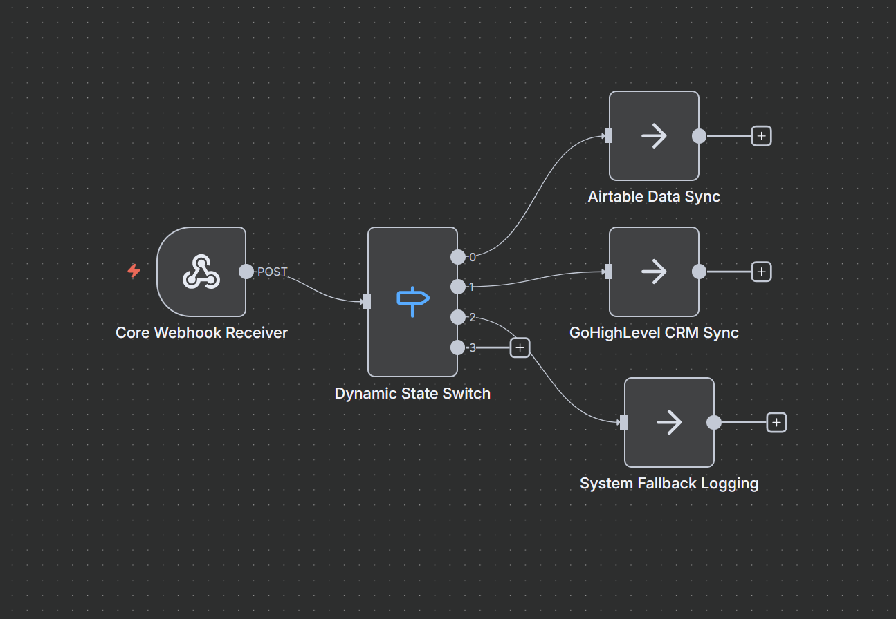

# Advanced Webhook Router & CRM State Machine

## 📌 Project Overview
An enterprise-grade orchestration pipeline built to decouple system communication silos. This workflow intercepts multi-platform API payloads and uses a dynamic logical matrix to manage systemic states across relational databases and customer management infrastructure with zero data loss.

## 🛠️ Technology Stack
- **Orchestration Framework:** n8n Workflow Automation
- **Data Integrations:** Airtable Engine & GoHighLevel CRM Infrastructure
- **Structural Routing:** Programmatic Conditional Switches

## ⚙️ Architecture & Logic
1. **Unified Event Ingestion:** Operates as a singular high-throughput webhook terminal catching disparate cloud events.
2. **Dynamic Route Segmentation:** Implements zero-latency state switches to map data schemas matching either deep storage (Airtable) or immediate operations (GoHighLevel Pipelines).
3. **Failsafe Catch-All Mechanism:** Includes a secondary pipeline structure that secures unclassified or custom telemetry events into structured error captures, protecting upstream configurations.
